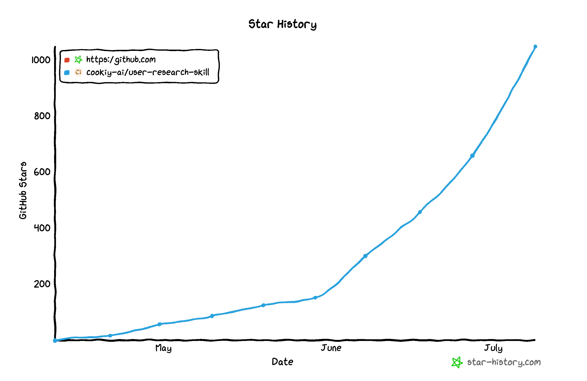

<!-- Part of the Cookiy user-research skill · https://github.com/cookiy-ai/user-research-skill -->


# User Research Skill for AI Agents

**The human layer in the AI stack** — give any AI agent direct access to real human opinions, experiences, and decision-making.

[](LICENSE)

---

## Creators are talking about us 🎬

> **900K+ views** and **5,000+ comments** across creators putting this skill to work.

<table>
  <tr>
    <td width="50%">

https://github.com/user-attachments/assets/5f4b31e8-4cfe-4c96-bae2-511a1636c9c5

<sub><b>@maxjohnscn</b> · 106K views · 1,608 likes · 3,051 comments</sub>

</td>
    <td width="50%">

https://github.com/user-attachments/assets/04fbc50c-d57e-4cf9-9f5d-246d5d55fc72

<sub><b>@maxjohnscn</b> · 57.7K views · 1,176 likes · 1,314 comments</sub>

</td>
  </tr>
  <tr>
    <td width="50%">

https://github.com/user-attachments/assets/f5bf50b6-34e8-4747-bc48-6420fc62333e

<sub><b>@rishiexplainsai</b> · 142K views · 494 likes · 634 comments</sub>

</td>
    <td width="50%">

https://github.com/user-attachments/assets/78b2964d-e100-4ea1-b19d-3b51fab3ae1d

<sub><b>@carrie.researcher</b> · 610K views · 14,093 likes · 111 comments</sub>

</td>
  </tr>
</table>

---

## What is this?

An AI agent skill that enables any AI platform to **plan, run, and synthesize user research** — both qualitative (interviews) and quantitative (surveys) — without leaving the conversation.

Use it for **general-purpose research** (design research plans, interview guides, synthesize reports), or connect to **Cookiy AI** to run **end-to-end studies** with real or synthetic participants.

---

## Capabilities

| | Capability | Description |
|---|---|---|
| **Plan** | Research Planning | Generates research plans, screening questionnaires, and interview guides |
| **Synthesize** | Report Synthesis | Turns raw interview transcripts into evidence-backed reports with codebooks, personas, and prioritized findings |
| **Qual** | Qualitative Studies | AI-moderated interviews with real or synthetic participants, via Cookiy AI |
| **Quant** | Quantitative Surveys | Multi-language surveys with conditional logic, respondent recruitment, and results — via Cookiy AI |

---

## Install

### Claude Cowork / Code Desktop

1. `Customize` > `Personal Plugins` > `+` > `Create Plugin` > `Add marketplace`, input `cookiy-ai/user-research-skill`, click `Sync`
2. `Plugins` > `Personal` > `user-research-skill`, click `+` on `User research`
3. (**Claude Cowork only**) Enable network access: `Profile` (bottom left) > `Settings` > `Capabilities` > `Code execution and file creation` > turn on `Allow network egress`, then set `Domain allowlist` to `All domains` — or add `s-api.cookiy.ai` under `Additional allowed domains`.

### Claude Chat Desktop

1. Download the [Skill ZIP file](https://github.com/cookiy-ai/user-research-skill/releases/download/latest/user-research-cookiy-skill.zip)
2. In the app: `Customize` > `Skills` > `+` > `Create Skill` > `Upload a skill`
3. Enable network access: `Profile` (bottom left) > `Settings` > `Capabilities` > `Code execution and file creation` > turn on `Allow network egress`, then set `Domain allowlist` to `All domains` — or add `s-api.cookiy.ai` under `Additional allowed domains`.

### Claude Code Terminal

```bash
/plugin marketplace add cookiy-ai/user-research-skill
/plugin install user-research@cookiy-ai
/reload-plugins
```

**Optional — enable auto-update:** `/plugin`, then choose `Marketplaces` tab > `cookiy-ai` > `Enable auto-update`

### Codex / Cursor / OpenClaw / Other Agents

```bash
npx cookiy-ai
```

Or follow your agent's skill installation instructions to install manually.

---

## Usage

- Type `/user-research-cookiy` to explicitly invoke the skill.
- Or just describe your research goal — your agent will load the skill automatically based on semantic matching.

---

## Examples

> *"I want to understand why users churn after onboarding"*
> — Designs a research plan, screener, and interview guide targeting early-stage drop-off.

> *"Here are 20 interview transcripts, give me a report"*
> — Runs a five-phase synthesis pipeline and produces a structured report with themes and personas.

> *"Run a study on how developers choose CI/CD tools"*
> — Via Cookiy AI: creates the study, runs AI-moderated interviews, and delivers the report.

> *"Survey 200 users about feature satisfaction"*
> — Via Cookiy AI: designs a survey, recruits respondents, and collects results.

---

## Star History

[](https://www.star-history.com/#cookiy-ai/user-research-skill&Date)

---

## License

[MIT](LICENSE) — Cookiy AI
